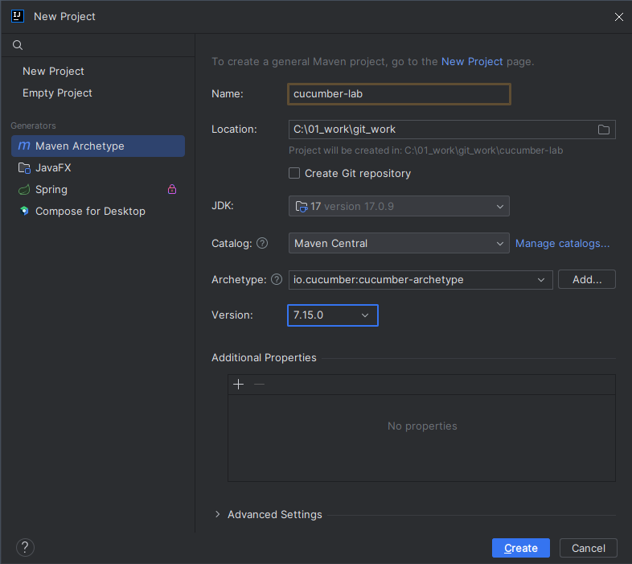
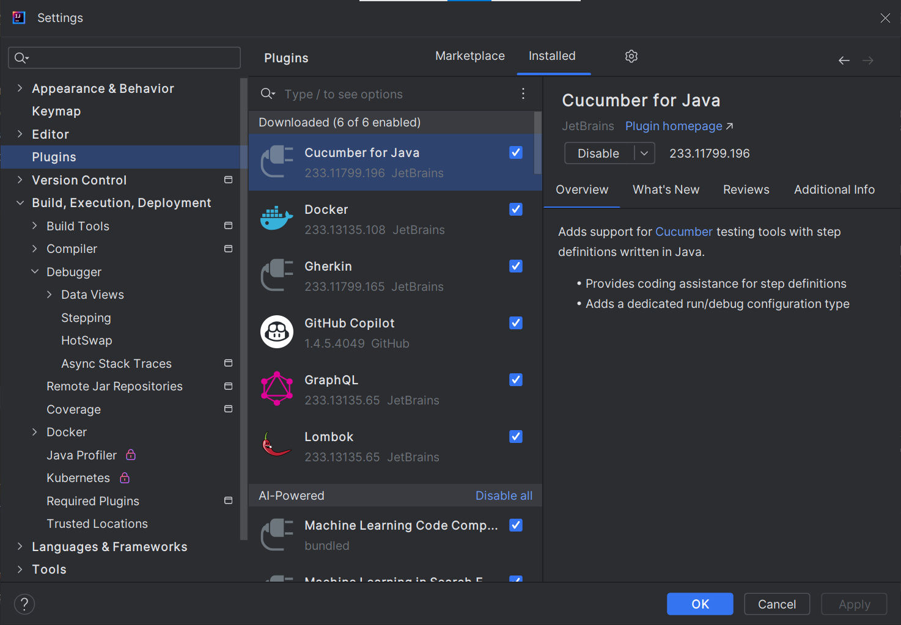
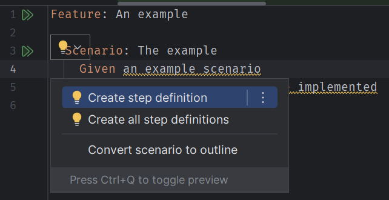
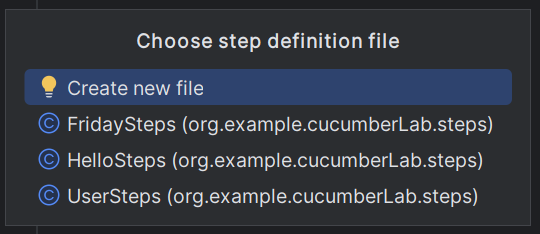
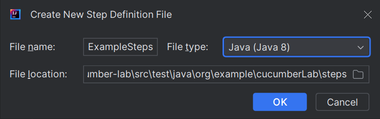

本專案執行環境設定為：
1. Java 17
2. Maven 3
3. Spring Boot 3.2.0
4. Cucumber 7.15.0
5. JUnit 5

使用的IDE為IntelliJ IDEA CE

### 專案建立方式
1. 建立新專案：File -> New -> Project -> Maven Archetype
2. Catalog 選擇 Maven Central
3. 在 Archetype 欄位搜尋關鍵字 `cucumber-archetype`

4. 按下 Create 按鈕

### 初始專案架構
```text
├── pom.xml
└── src
    ├── main
    └── test
        ├── java
        │   └── org
        │       └── example
        │           └── RunCucumberTest.java
        │           └── StepDefinitions.java
        └── resources
            └── org
                └── example
                    └── example.feature
```
`cucumber-archetype` 這個Archetype會自動幫我們建立好專案的基本架構
#### example.feature
example.feature 是我們的測試案例，這個檔案是使用Gherkin語法撰寫的，Gherkin語法是一種自然語言的語法，可以讓非開發人員也能看懂測試案例的內容。
```gherkin
Feature: An example

  Scenario: The example
    Given an example scenario
    When all step definitions are implemented
    Then the scenario passes
```
主要有包含以下語法：
1. Feature: 代表這個檔案的功能
2. Scenario: 代表一個測試案例
3. Given: 代表測試案例的前置條件
4. When: 代表測試案例的執行動作
5. Then: 代表測試案例的預期結果
6. And: 代表測試案例的其他條件
9. Scenario Outline: 代表測試案例的多個測試案例

Scenario Outline的語法如下：
```gherkin
Scenario Outline: Eating
  Given there are <start> cucumbers
  When I eat <eat> cucumbers
  Then I should have <left> cucumbers

  Examples:
    | start | eat | left |
    |    12 |   5 |    7 |
    |    20 |   5 |   15 |
```
可以看得出來，它可以讓我們一次撰寫多個測試案例，並且可以使用Examples來定義測試案例的參數。

其他還有一些語法，可以參考 [Gherkin Reference](https://cucumber.io/docs/gherkin/reference/)

#### RunCucumberTest.java
RunCucumberTest.java 是我們的測試執行檔案，這個檔案會去執行我們的測試案例，並且會去尋找 StepDefinitions.java 這個檔案來對應測試案例的步驟。
```java
@Suite
@IncludeEngines("cucumber")
@SelectClasspathResource("org/example")
@ConfigurationParameter(key = PLUGIN_PROPERTY_NAME, value = "pretty")
public class RunCucumberTest {
}
```

#### StepDefinitions.java
StepDefinitions.java 是我們的測試案例的步驟定義檔案，這個檔案會去對應 example.feature 的測試案例步驟。
```java
public class StepDefinitions {

    @Given("an example scenario")
    public void anExampleScenario() {
    }

    @When("all step definitions are implemented")
    public void allStepDefinitionsAreImplemented() {
    }

    @Then("the scenario passes")
    public void theScenarioPasses() {
    }

}
```
在 Feature檔案中的 Given, When, Then, And 這些步驟，都會對應到 StepDefinitions.java 中的方法，並且會去執行方法內的程式碼。
在IntelliJ中可以安裝Cucumber for Java 這個套件，可以讓我們在撰寫 StepDefinitions.java 時，可以自動產生對應的方法。



使用方法很簡單，首先，開啟Feature檔案。在出現警示符號的文字上按下小燈泡。



按下後，會出現一個選單，選擇 Create all step definition，就會自動產生對應的方法。





如此一來，就可以省去我們自己去撰寫方法的時間。但內容還是要實作。

### 執行測試案例
開啟 Console 視窗，輸入以下指令：
```shell
mvn test
```
這樣就可以執行測試案例了。

### 關於與Spring Boot整合
本專案有實作與Spring Boot整合的範例。
首先，在測試案例資料夾裡，需要寫程式來設定Spring Boot。注意，這是給測試案例時使用的Spring Boot設定，與放在`src/main/java`的Spring Boot設定不同。

#### src/test/resources/application.yml
專門給測試案例使用的Spring Boot 設定檔案。

#### src/test/java/org/example/config/CucumberSpringConfiguration.java
Cucumber的設定檔，用以設定Cucumber，以及告知程式如何讀取 Spring Boot 設定。
```java
@CucumberContextConfiguration
@SpringBootTest(classes = {
    TestConfig.class}, webEnvironment = SpringBootTest.WebEnvironment.RANDOM_PORT)
public class CucumberConfig {

}
```
1. `@CucumberContextConfiguration` 是告訴程式，這個檔案是Cucumber的設定檔。

2. `@SpringBootTest` 的 `classes` 參數，是告訴程式要去讀取哪些Spring Boot的設定檔案，這邊是讀取 `TestConfig.java` 這個檔案。

3. `@SpringBootTest` 的 `webEnvironment` 參數，是告訴程式要使用哪種方式來執行Spring Boot，這邊是使用 `RANDOM_PORT`，也就是隨機選擇一個Port來執行Spring Boot。

#### src/test/java/org/example/config/TestConfig.java
Spring Boot的設定檔，用以設定Spring Boot。
```java
@Configuration
@EnableAutoConfiguration
@ComponentScan(basePackages = "org.example.cucumberLab")
public class TestConfig {

  //要在測試案例中使用的Bean
  @Bean
  public User user() {
    return User.builder()
        .name("Jack")
        .age(42)
        .build();
  }
}
```
1. `@Configuration` 是告訴程式，這個檔案是Spring Boot的設定檔。
2. `@EnableAutoConfiguration` 是告訴程式，要自動載入Spring Boot的設定檔。
3. `@ComponentScan` 是告訴程式，要掃描哪些套件，這邊是掃描`org.example.cucumberLab`這個套件。
4. `@Bean` 是告訴程式，要建立一個Bean，這邊是建立一個User的Bean。

本專案裡用兩個案例來說明。一個會讀取User這個bean的內容來做測試，一個則是會測試/hello這個API。

#### is_user_name_is_jack.feature
這個測試案例的Story是要測試User這個 Bean 的名字是否為Jack。
```gherkin
Feature: Is user's name Jack?

  Scenario Outline:
    Given I have a name "<name>"
    When I ask if my name is correct
    Then I should see "<result>"

    Examples:
      | name  | result |
      | Jack  | Yes    |
      | Mary  | No     |
      | Simon | No     |
```
我們使用了 `Scenario Outline` 來定義多個測試案例，並且使用 `Examples` 來定義測試案例的參數。
在 `Given` 中，會給定一個變數 `name`，並且會在 `When` 中使用這個變數，最後在 `Then` 中會使用這個變數與輸入的 `result` 來判斷結果。
詳細的實作程式在`src/test/java/org/example/cucumberLab/steps/UserSteps.java`這個檔案中。
```java
@RunWith(Cucumber.class)
public class UserSteps {

  private String name;

  private String answer;

  @Autowired
  private User user;


  @Given("I have a name {string}")
  public void iHaveAName(String name) {
    this.name = name;
  }

  @When("I ask if my name is correct")
  public void iAskIfMyNameIsCorrect() {
    this.answer = (name.equals(user.getName())) ? "Yes" : "No";
  }

  @Then("I should see {string}")
  public void iShouldSee(String arg0) {
    assertEquals(arg0, answer);
  }

}
```
要使用 `@RunWith` 來告訴程式，這個檔案是 Cucumber 測試案例的步驟定義檔案。

#### is_hello.feature
這個測試案例會測試 `/hello` 這個API。
```gherkin
Feature: Is HelloController working?

  Scenario:
    When I call hello API
    Then I should see the response body "Hello World!"
```
詳細的實作程式在 `src/test/java/org/example/cucumberLab/steps/HelloSteps.java` 這個檔案中。
```java
@RunWith(Cucumber.class)
public class HelloSteps {

  @LocalServerPort
  private int port;

  @Autowired
  private TestRestTemplate restTemplate;

  private String result;

  @When("I call hello API")
  public void iCallHelloAPI() {
    this.result = this.restTemplate.getForObject("http://localhost:" + port + "/hello",
        String.class);
  }

  @Then("I should see the response body {string}")
  public void iShouldSeeTheResponseBody(String content) {
    assert (content.equals(this.result));
  }
}
```
可以看到這個測試案例沒有`Given`，而且`When` 沒有傳入參數，因為 `/hello` 這個API不需要傳入參數，所以就不需要在 `When` 中傳入參數。
只要取得 API 回傳的內容，並判斷其結果是否符合即可。

`@LocalServerPort` 是告訴程式，要使用哪個Port來執行呼叫對應的API。


